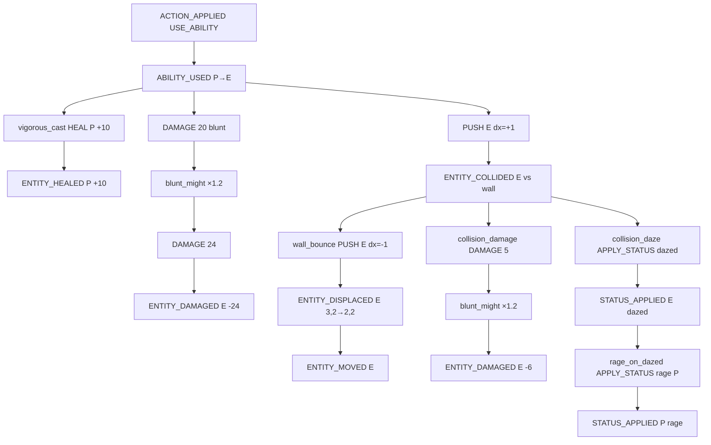
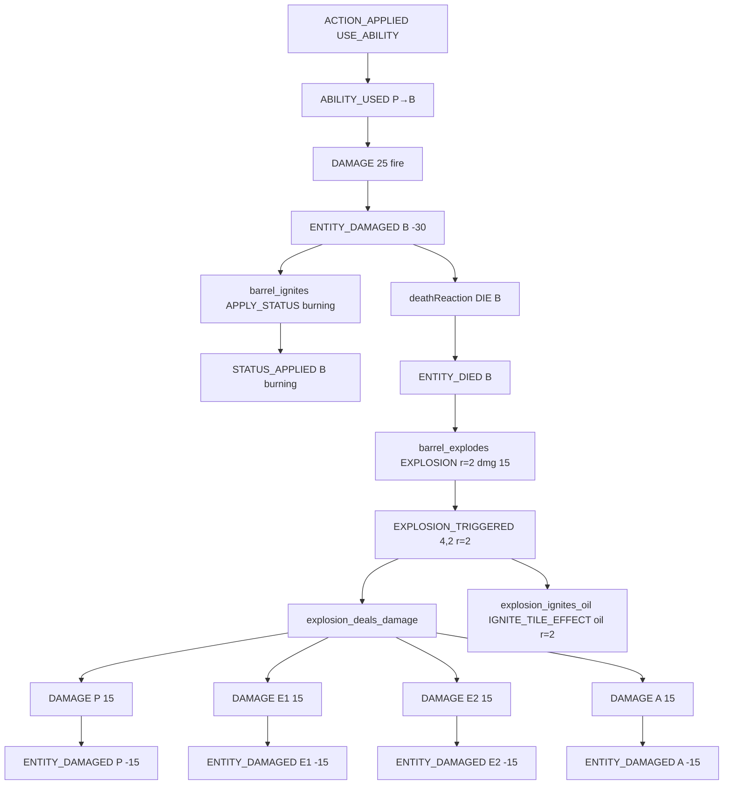

# Боевые примеры

> Короткие примеры сложных боевых цепочек по концепту боевой системы.
> Скилл создаёт интенты, правила их модифицируют и реагируют на события.

## Термины

- **Модификатор** — `ContentRule` с эффектом `MODIFY_DAMAGE`, срабатывает на `Intent` до исполнения.
- **Реакция** — `ContentRule` с эффектом `APPLY_STATUS`, `DEAL_DAMAGE`, `HEAL`, `PUSH`, `EXPLOSION` и т.д., срабатывает на `GameEvent` внутри `ExecutionNode`.
- **Системная реакция** — неизменный код мира (`deathReaction`, `collisionDamageReaction` и т.д.).

---

## Пример 1. Мощный удар: урон, отталкивание, стена, dazed, rage

### Сущности

| Сущность | Позиция | HP | Примечание |
|---|---|---|---|
| P | (2,2) | 80/80 | игрок, экипировка даёт правила |
| E | (3,2) | 50/50 | враг |
| — | (4,2) | — | стена |

### Скилл

Создаёт два интента:

1. `DAMAGE E 20` — теги `damage.physical.blunt`, `attack.melee`
2. `PUSH E dx=+1`

### Правила

| ID | Тип | Триггер | Эффект | Слой |
|---|---|---|---|---|
| `blunt_might` | модификатор | `DAMAGE` + `damage.physical.blunt` | `MODIFY_DAMAGE ×1.2` | source |
| `vigorous_cast` | реакция | `ABILITY_USED` | `HEAL 10` target `self` | source |
| `wall_bounce` | реакция | `ENTITY_COLLIDED` + `collision.wall` | `PUSH` на 1 клетку в обратную сторону | world |
| `collision_damage` | системная | `ENTITY_COLLIDED` | `DAMAGE 5` `damage.physical.blunt` | — |
| `collision_daze` | системная | `ENTITY_COLLIDED` | `APPLY_STATUS dazed` | — |
| `rage_on_dazed` | реакция | `STATUS_APPLIED` + `status.dazed` | `APPLY_STATUS rage` target `self` | radius |

### Дерево выполнения

### Ключевые моменты

- Модификатор `blunt_might` срабатывает **дважды**: на основной удар и на урон от столкновения.
- `wall_bounce` — контентная реакция мира, срабатывает до системных реакций столкновения.
- `rage_on_dazed` — радиусное правило наблюдателя P; `self` разрешается в P.

---

## Пример 2. Огненный снаряд и бочка: поджог, смерть, взрыв

### Сущности

| Сущность | Позиция | HP | Теги |
|---|---|---|---|
| P | (2,2) | 80/80 | player |
| B | (4,2) | 20/20 | `object.barrel` |
| E1 | (3,2) | 40/40 | enemy |
| E2 | (6,2) | 40/40 | enemy |
| A | (5,3) | 40/40 | ally |

### Скилл

Создаёт интент:

- `DAMAGE B 25` — теги `damage.magical.fire`, `attack.ranged`

### Правила

| ID | Тип | Триггер | Эффект |
|---|---|---|---|
| `barrel_ignites` | реакция | `ENTITY_DAMAGED` + `damage.magical.fire`, цель `object.barrel` | `APPLY_STATUS burning` |
| `barrel_explodes` | реакция | `ENTITY_DIED`, цель `object.barrel` + `burning` | `EXPLOSION` r=2, dmg 15 |
| `explosion_deals_damage` | реакция | `EXPLOSION_TRIGGERED` | `DEAL_DAMAGE` `event.damage` всем в радиусе 2 |
| `explosion_ignites_oil` | реакция | `EXPLOSION_TRIGGERED` | `IGNITE_TILE_EFFECT` oil в радиусе 2 |

### Дерево выполнения

### Ключевые моменты

- Скилл не знает про бочки и взрывы — он просто наносит огненный урон.
- `barrel_explodes` срабатывает только потому, что `barrel_ignites` успело наложить `burning` до системной реакции смерти.
- `EXPLOSION` — семантический интент. Урон наносится отдельным правилом на `EXPLOSION_TRIGGERED`, чтобы можно было добавлять другие эффекты взрыва.
