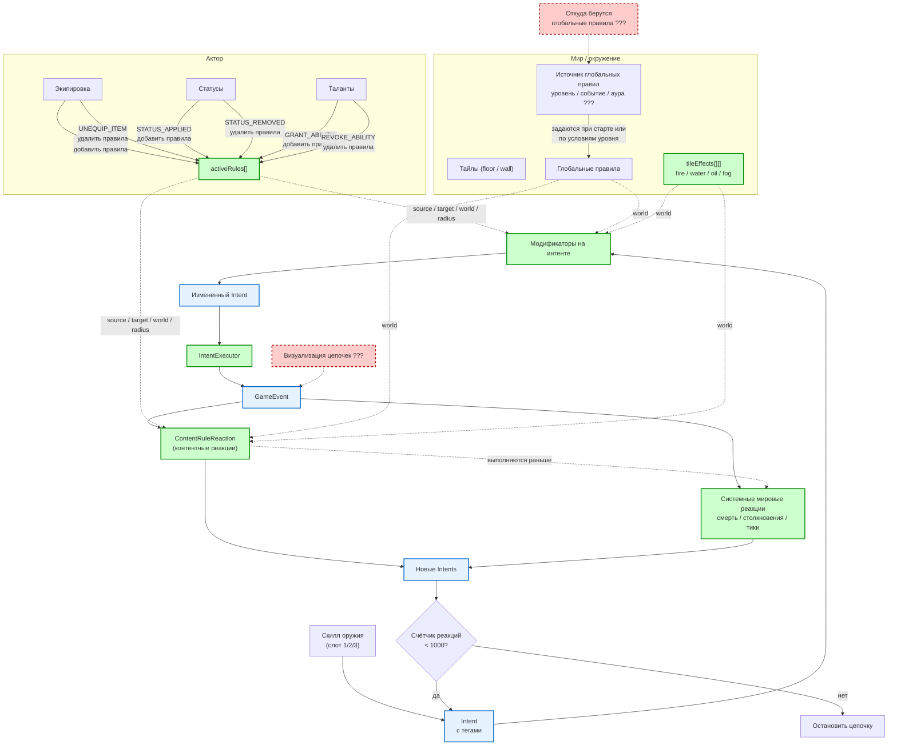

# Диаграмма концепта боевой системы

> Диаграмма в формате Mermaid. Её можно открыть в любом Markdown-редакторе с поддержкой Mermaid (GitHub, GitLab, Obsidian, VS Code с плагином) или вставить код на [mermaid.live](https://mermaid.live).
>
> Блоки с `???` и красной пунктирной рамкой — вещи, которые ещё не проработаны.

## Что показывает диаграмма

### Жизненный цикл правил

- Правила живут на **экипировке**, **статусах** и **талантах**.
- При надевании/снятии предмета, наложении/снятии статуса, получении/отзыве таланта правила добавляются или удаляются из `activeRules` актора.
- Правила из `activeRules`, **слой `tileEffects`** и **глобальные правила** используются на фазах модификаторов и реакций.

### Игровой цикл

1. **Скилл** создаёт `Intent` с тегами.
2. **Модификаторы** применяются **до** выполнения интента. Они собираются от источника, цели, мира (`tileEffects`, шаблоны тайлов) и сущностей в радиусе.
3. **IntentExecutor** применяет изменённый интент и создаёт `GameEvent`.
4. Сначала срабатывает **ContentRuleReaction** (контентные реакции), затем — **системные мировые реакции**. Обе могут породить новые интенты.
5. Новые интенты снова проходят через модификаторы → исполнитель → реакции, пока не сработает ограничение на количество реакций.

### Что ещё не продумано

Блоки с `???` и красной пунктирной рамкой (ещё не проработано):

- **Источник глобальных правил** — уровень, события, ауры или что-то ещё.
- **Визуализация** — как показывать игроку цепочки реакций.

Решено и вынесено из красной рамки:

- **Порядок системных vs контентных реакций** — сначала контентные (`ContentRuleReaction`), затем системные; внутри блока по `priority`, tie-break по `ruleId`.
- **Формат хранения правил** — отдельные ассеты, шаблоны ссылаются по `ruleIds`.
- **Язык условий** — декларативный JSON с операторами `chance`, `hasStatus`, `statCompare`, `distance`, `faction`, `and`, `or`, `not`.
- **Набор эффектов** — core-набор: `MODIFY_DAMAGE`, `APPLY_STATUS`, `DEAL_DAMAGE`, `HEAL`, `RESTORE_AP`, `CONSUME_AP`.
- **Тайловые эффекты** — слой `tileEffects` в `GameState`; стартовый набор `fire`, `water`, `oil`, `fog`; базовые переходы выполняются напрямую, сложные реакции — через `ContentRuleReaction`.

## Как отрендерить

- Вставьте код диаграммы на [mermaid.live](https://mermaid.live).
- Или откройте этот файл в редакторе с поддержкой Mermaid (VS Code + плагин Markdown Preview Mermaid Support).
- В GitHub / GitLab Markdown-диаграмма отобразится автоматически.
