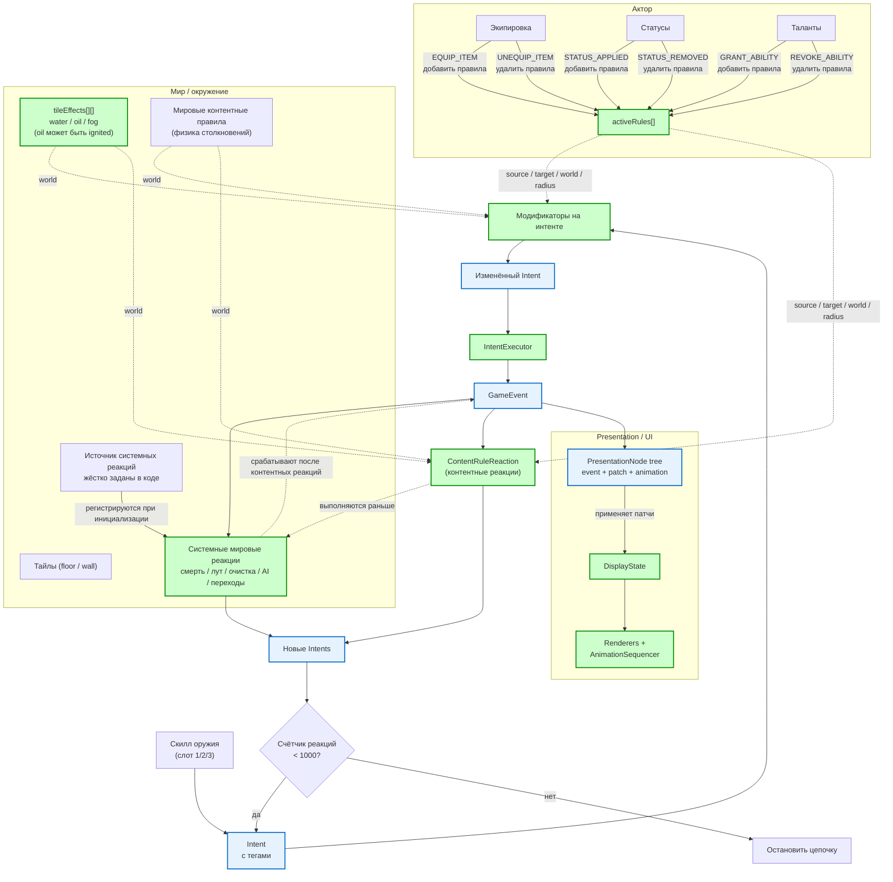

# Диаграмма концепта боевой системы

> Диаграмма в формате Mermaid. Её можно открыть в любом Markdown-редакторе с поддержкой Mermaid (GitHub, GitLab, Obsidian, VS Code с плагином) или вставить код на [mermaid.live](https://mermaid.live).
>
> Ранее непроработанные места отмечались красной пунктирной рамкой. Сейчас таких
> блоков нет — они либо решены, либо вынесены в отдельные документы.

## Что показывает диаграмма

### Жизненный цикл правил

- Правила живут на **экипировке**, **статусах** и **талантах**.
- При надевании/снятии предмета, наложении/снятии статуса, получении/отзыве таланта правила добавляются или удаляются из `activeRules` актора.
- Правила из `activeRules`, **мировые контентные правила** и **слой `tileEffects`** используются на фазах модификаторов и контентных реакций. **Системные мировые реакции** работают отдельно и срабатывают после контентных.

### Игровой цикл

1. **Скилл** создаёт `Intent` с тегами.
2. **Модификаторы** применяются **до** выполнения интента. Они собираются от источника, цели, мира (мировые правила, `tileEffects`, шаблоны тайлов) и сущностей в радиусе.
3. **IntentExecutor** применяет изменённый интент и создаёт `GameEvent`.
4. Сначала срабатывает **ContentRuleReaction** (контентные реакции), затем — **системные мировые реакции**. Обе могут породить новые интенты.
5. Новые интенты снова проходят через модификаторы → исполнитель → реакции, пока не сработает ограничение на количество реакций.

### Что ещё не продумано

На данный момент в диаграмме боевой концепции не осталось красных
непроработанных блоков. Решены базовые физические комбо и граница предсказуемости vs сюрприз.
Более сложные физические комбо и инструменты каталогизации правил
остаются открытыми для обсуждения.

> **Источник системных мировых реакций** решён: это жёстко заданные в коде реакции, регистрируемые при инициализации. Динамические мировые правила отложены на будущее.

Решено и вынесено из красной рамки:

- **Визуализация цепочек реакций** — решена через `DisplayState` в Presentation Layer: события из `ExecutionNode` последовательно применяют патчи к отображаемому состоянию, а UI показывает промежуточные состояния по ходу анимаций. Подробности в [`docs/plans/Презентационный_слой_и_UI.md`](./Презентационный_слой_и_UI.md).
- **Порядок системных vs контентных реакций** — сначала контентные (`ContentRuleReaction`), затем системные; внутри блока по `priority`, tie-break по `ruleId`.
- **Формат хранения правил** — декларативные TS-объекты в модулях, шаблоны ссылаются по `ruleIds`.
- **Язык условий** — декларативный формат с операторами `chance`, `hasStatus`, `statCompare`, `distance`, `faction`, `inTileEffect`, `and`, `or`, `not`.
- **Набор эффектов** — core-набор: `MODIFY_DAMAGE`, `APPLY_STATUS`, `REMOVE_STATUS`, `DEAL_DAMAGE`, `HEAL`, `RESTORE_AP`, `CONSUME_AP`. `MODIFY_DAMAGE` расширен: `multiply` может быть `ParametrizedValue`, добавлено поле `addTags`.
- **Тайловые эффекты** — слой `tileEffects` в `GameState`; стартовый набор `water`, `oil`, `fog`. `oil` может находиться в состоянии `ignited` (горящее масло). Базовые переходы выполняются напрямую, сложные реакции — через `ContentRuleReaction`.
- **Таргетинг и контекст правил** — введён `ownerContext`; `self` разрешается через него; поддерживаются селекторы `eventTarget`, `eventSource`, `self`, `collisionTarget`, `allInRadius`, `nearestEnemy`, `chain`; условия разделены на глобальные `conditions` и per-candidate `targetConditions`.
- **Защита от циклов реакций (MVP)** — глобальный лимит в 1000 реакций за одну цепочку принят как аварийный предохранитель. Дополнительные механизмы (каузальная блокировка, запрет пар правил, журналирование циклов) отложены на post-MVP.
- **Статусы, наложенные в цепочке (MVP)** — правила такого статуса не участвуют в текущей цепочке, активируются после её завершения.
- **Эффект `REMOVE_STATUS`** — добавлен в core-набор эффектов для снятия статусов в реакциях.
- **Событие `STATUS_BLOCKED`** — порождается, когда `blockedBy` статуса не позволяет наложить новый статус.
- **Взаимоисключение статусов** — системное поведение `APPLY_STATUS` через поля `mutuallyExclusiveWith`, `blockedBy`, `statusCategory` и `categoryPriority` в шаблоне статуса.
- **Стихийная модель** — зафиксировано взаимодействие статусов `wet` / `oiled` / `burning` и тайловых эффектов `water` / `oil` / `fog`; огненный урон поджигает `oil`, создавая горящее масло и взрыв; вода тушит горящее масло, образуя пар.
- **Мировые контентные правила** — базовая физика мира (`collision_damage`, `collision_daze`) вынесена в data-driven правила, которые всегда активны в слое `world` и выполняются до системных инвариантов.
- **Базовые физические комбо** — зафиксированы как контентные правила от оружия: `piercing_crit` (колющий крит, множитель от `dex`, тег `attack.crit`), `blunt_melee_stun` (дробящий стан при ударе, длительность от `str`), `blunt_push_wall_stun` (дробящий стан при толчке в стену, если цель `dazed`), `slashing_causes_bleeding` (рубящее кровотечение).
- **Статус `dazed`** — лёгкое оглушение (-1 AP на следующий ход), накладываемое мировым правилом `collision_daze` при насильственном столкновении; заменяется `stunned`.
- **Граница предсказуемости vs сюрприз** — решено: полный превью цепочки не показывается; все правила открыты при инспекции; combat log показывает только ключевые события; сюрприз остаётся на уровне шансовых срабатываний и непредсказуемых цепочек.

## Как отрендерить

- Вставьте код диаграммы на [mermaid.live](https://mermaid.live).
- Или откройте этот файл в редакторе с поддержкой Mermaid (VS Code + плагин Markdown Preview Mermaid Support).
- В GitHub / GitLab Markdown-диаграмма отобразится автоматически.
