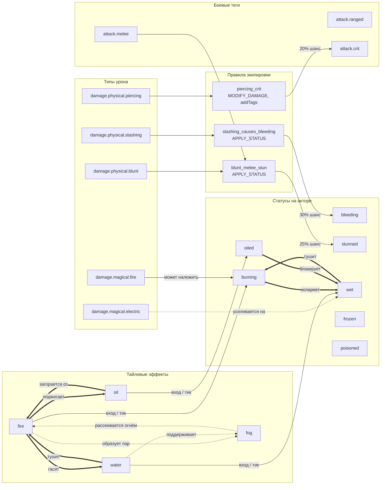

# Диаграмма зависимостей боевой системы

> Карта связей между типами урона, действиями, правилами экипировки, статусами и тайловыми эффектами.
> Диаграмма в формате Mermaid — её можно открыть в любом редакторе с поддержкой Mermaid или на [mermaid.live](https://mermaid.live).

---

## Общая схема зависимостей

---

## Легенда

| Стрелка | Значение |
|---|---|
| `--- >` | Прямая причинно-следственная связь: одно порождает другое. |
| `=== >` | Системное взаимоисключение или блокировка: один элемент снимает/блокирует другой. |
| `-.- >` | Косвенное влияние или усиление: элемент модифицирует эффект другого. |

---

## Что показывает диаграмма

### 1. Физические комбо от оружия

- **Колющий урон** → правило `piercing_crit` → шанс 20% крита с тегом `attack.crit`. Множитель крита: `1.5 + dex / 10` (min 1.5, max 3.0).
- **Дробящий урон + ближний бой** → правило `blunt_melee_stun` → шанс `stunned`.
- **Рубящий урон** → правило `slashing_causes_bleeding` → шанс `bleeding`.

Все три правила крепятся к шаблонам оружия через `ruleIds` и попадают в `activeRules` актора при экипировке.

### 2. Стихийные комбо

- **Огонь** (урон или тайловый эффект) накладывает `burning`.
- **Вода** (тайловый эффект) накладывает `wet`.
- **Масло** (тайловый эффект) накладывает `oiled`.
- `wet` тушит `burning`.
- `burning` испаряет `wet`.
- `oiled` блокирует наложение `wet`.
- Электрический урон усиливается, если цель `wet`.

### 3. Взаимодействия тайловых эффектов

- `fire` + `oil` → масло загорается, огонь усиливается.
- `fire` + `water` → оба удаляются, появляется `fog`.
- `fog` рассеивается огнём и поддерживается водой.

---

## Непоказанные связи

Диаграмма отражает только зафиксированный минимальный набор. Не показаны:

- Сложные физические цепочки: толчок → столкновение → AoE-ударная волна.
- Кровотечение + движение → дополнительный урон.
- Все возможные модификаторы от брони, талантов и аур.
- Детали Presentation Layer (как отображаются криты, статусы и тайловые эффекты).

---

## Как отрендерить

- Вставьте код диаграммы на [mermaid.live](https://mermaid.live).
- Или откройте этот файл в редакторе с поддержкой Mermaid (VS Code + плагин Markdown Preview Mermaid Support).
- В GitHub / GitLab Markdown-диаграмма отобразится автоматически.
